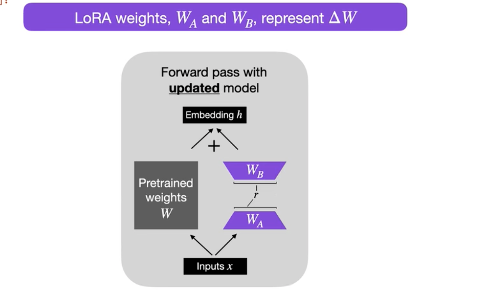
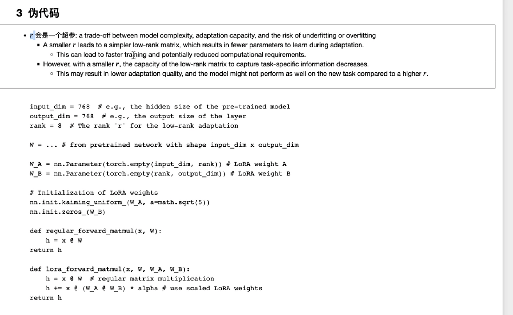
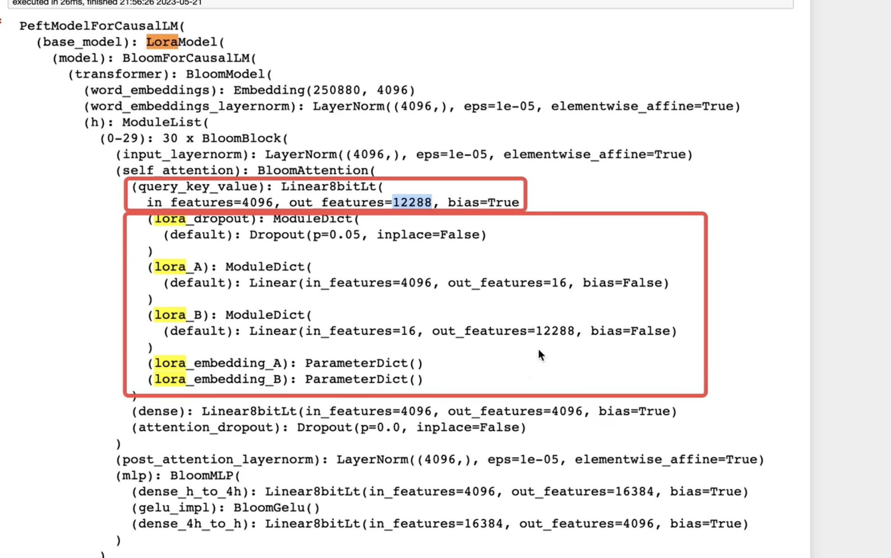
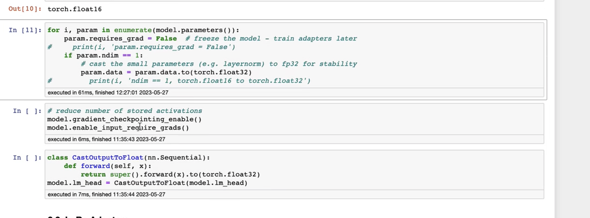
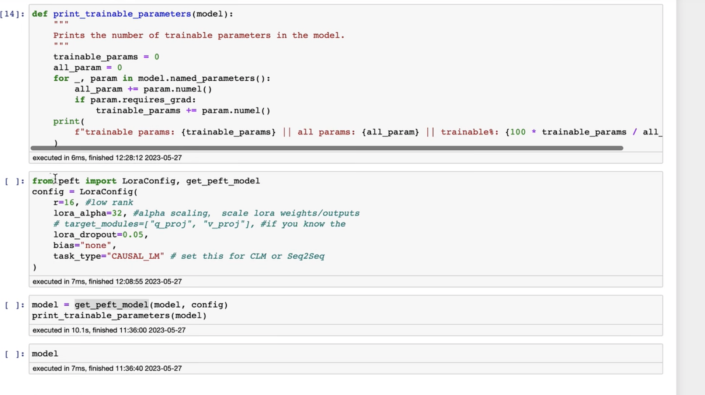
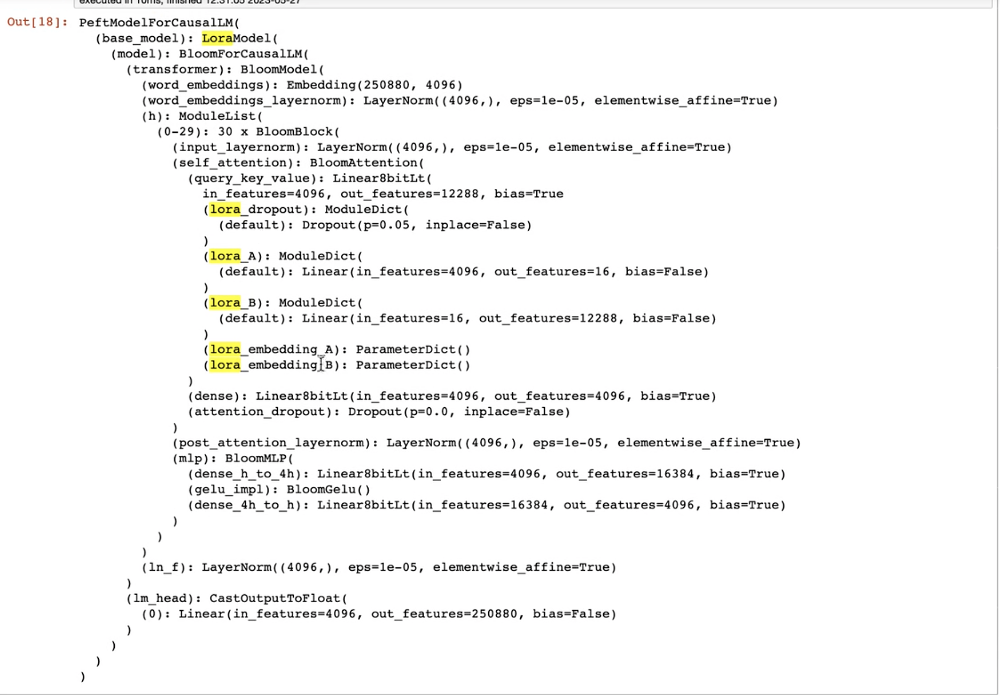
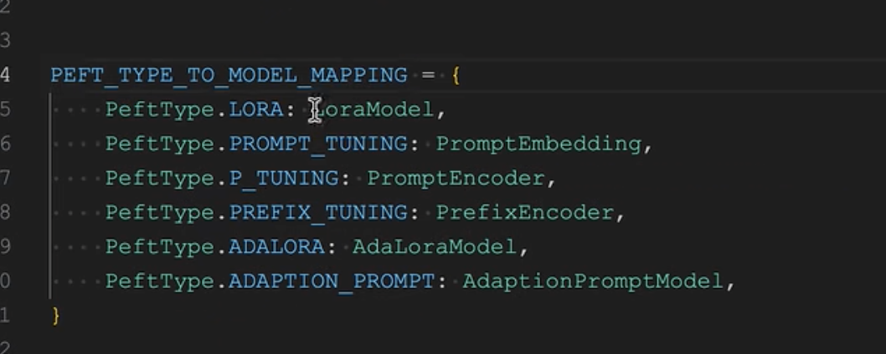

lora 输入权重如图所示：

lora伪代码

上述文本的alpha，控制W_A和W_B的强度。

下个图谱中，是运行代码看到的情况

1,训练的配置，首先冻结原有参数  
2,gradient_checkpoint_enable,允许梯度更新  
3,enable_input_require_grads,允许向量更新
4,第13行，混合精度，在forward的时候，将精度从int8转换到float32

1,只打印可以训练的参数
2,配置lora config，图片中lora rank设置为16，lora alpha设置为32
3,获取peft model，model = get_peft_model(model,config)。将原有model放进去，会得到loramodel。
4,利用第1步的，打印可训练参数。

loaramodel的效果如下：

源码解读：
peft支持的类型

参考:
https://www.bilibili.com/video/BV1qz4y1B7LB/?spm_id_from=333.788&vd_source=4fb27ce85cc2f3391060e052606cd579
https://www.bilibili.com/video/BV1sV4y1z7uS/?spm_id_from=333.788&vd_source=4fb27ce85cc2f3391060e052606cd579
